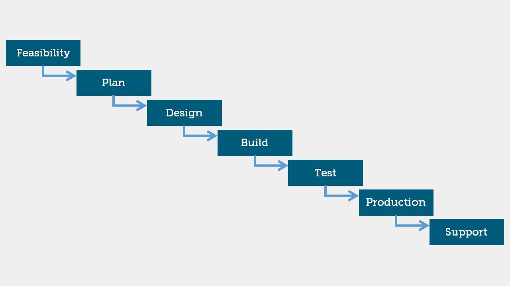
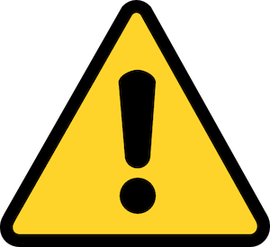
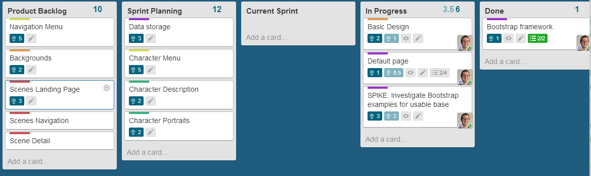

##Lessons to learn from Agile Software Development

---

##A Brief History of Software Development

---

##The Waterfall Methodology

---

##How can we deal with highly changing requirements and lots of unknowns?

---

---

##Case Study - FBI SENTINEL PROJECT

###Executive Summary:

Virtual Case File (or VCF) was a software application developed by the United States Federal Bureau of Investigation(FBI) between 2000 and 2005. The project was not close to completion when it was officially abandoned in January 2005, having turned into a complete fiasco for the FBI. In addition to wasting at least US $100 million, the failure brought widespread criticism to the bureau and its director, Robert S. Mueller III.

###Key Takeaways:

- $575 million dollars wasted on the first two attempts at the project
- Scrum Studio was set up in the basement of the Hoover Building
- Staff reduced from 400 to 40, and in 1 year and $30 million, they were code complete, at a cost savings of more than 90 percent

[More info](http://bit.ly/1fs07Ji)

---

##Introducing Agile Methodologies

###The Agile Manifesto

- Individuals and interactions over processes and tools
- Working software over comprehensive documentation
- Customer collaboration over contract negotiation
- Responding to change over following a plan

---

##Warning Major Jargon Ahead

---

##Introducing: Scrum 

---

##The Scrum Components

- Sprint Planning Meeting
- Sprint Backlog Refinement
-	Daily Scrum (a.k.a. the "standup")
- Sprint Review
- Sprint Retrospective

---

---

##Scrum Concepts

---

##Iteration over Prescription

---

##Self Organizing Teams
###Intentional Culture

---

##Backlog (Continually groomed list of tasks)

---

##Making Work Transparent

---

##DoD (Definition of Done)

---

##So what does this mean to us?

---

##What if...

Product = Changmaker Curriculum

Sprint = Term

Backlog = Improvements or new ideas

Scrum Master = anyone! (could even rotate)

Team = Everyone

---

##What does this mean for student projects?

---

[Agile in Education](http://www.agileineducation.org/)

---

## Example 1: [EduScrum](http://eduscrum.nl)

---

## Example 2: [Agile Learning Centers](http://agilelearningcenters.org/)

---

##Further Reading

[Scrum Reference Card](https://www.collab.net/sites/default/files/uploads/CollabNet_scrumreferencecard.pdf)

[Scrum - A Breathtakingly Brief and Agile Introduction](https://www.amazon.com/Scrum-Breathtakingly-Brief-Agile-Introduction/dp/193796504X)

[Scrum - The Art of Doing Twice As Much In Half The Time](https://www.amazon.com/Scrum-Doing-Twice-Work-Half/dp/038534645X/ref=pd_lpo_sbs_14_t_1?_encoding=UTF8&psc=1&refRID=S4D8QWK03G7ZG6PFQAME)

---
